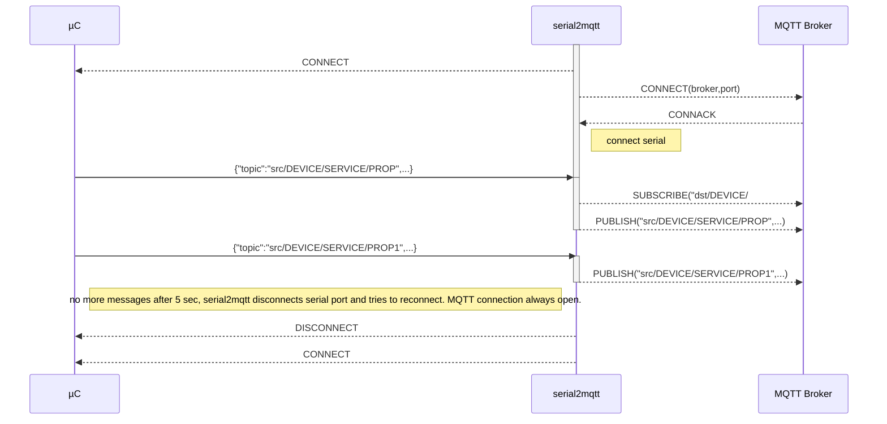
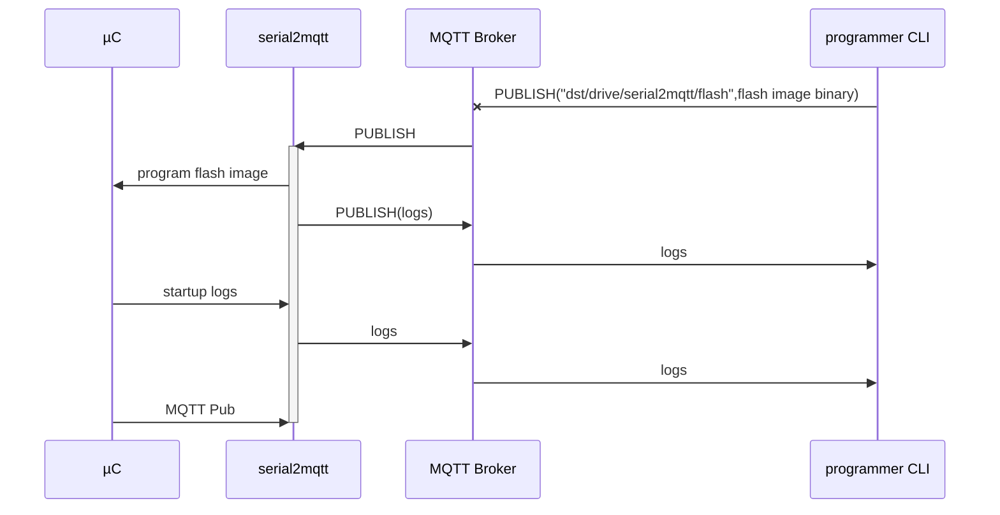

# serial2mqtt
For a complete view : [with UML sequence diagrams](https://vortex314.github.io/Serial2Mqtt.html)
MQTT for all micro-controllers ! The purpose is to offer MQTT publisher/subscriber functionality to all small micro controllers. Those with just a UART or USB interface.
Example : a cheap STM32 board on ebay.

This program will act as a full MQTT Client gateway and make integration as simple as possible.
This was created because Ethernet or WiFi is still absent in most ( cheap ) controllers .
Also the concept behind is that a central PC or Raspberry PI can act as the intelligent mind behind commodity components.

Arduino Sample program to communicate with the serial2mqtt  gateway

   

    #include <ArduinoJson.h>

    class Mqtt {
      public:
        static String device;
        static void publish( String topic, String message, int qos = 0, bool retained = false ) {
          StaticJsonBuffer<200> jsonBuffer;
          JsonObject& data = jsonBuffer.createObject();
          data["cmd"] = "MQTT-PUB";
          data["topic"] = "src/" + device + "/" + topic;
          data["message"] = message;
          if ( qos != 0 ) data["qos"] = qos;
          if ( retained) data["retained"] = retained;
          data.printTo(Serial);
          Serial.println();
        }
        static void handleLine(String& line) {
          StaticJsonBuffer<200> jsonBuffer;
          JsonObject& root = jsonBuffer.parseObject(line);
          onMqttMessage(root["topic"], root["message"], root["qos"], root["retained"]);
        }
    
        static void onMqttMessage(String topic, String message, int qos, bool retained) {
        // add your own subscriber here 
          Serial.printf(" Mqtt Message arrived");
        }
    };
    // create a name for this device
    String Mqtt::device = "ESP32-" + String((uint32_t)ESP.getEfuseMac(), HEX);
    
    void setup() {
      Serial.begin(115200);
      pinMode(LED_BUILTIN, OUTPUT);
      while (!Serial) {
        ; // wait for serial port to connect. Needed for native USB port only
      }
    }
    
    String line;
    void loop() {
      while (Serial.available()) {
        char ch = Serial.read();
        if ( ch == '\r' || ch == '\n' ) {
          Mqtt::handleLine(line);
          line = "";
        } else
          line += ch;
      }
      digitalWrite(LED_BUILTIN, HIGH);   // turn the LED on (HIGH is the voltage level)
      delay(100);                       // wait for a 0.1 second
      digitalWrite(LED_BUILTIN, LOW);    // turn the LED off by making the voltage LOW
      delay(100);                       // wait for a 0.1 second
      Mqtt::publish( "system/upTime", String(millis(), 10), 0, false);
      Mqtt::publish("system/host", Mqtt::device, 0, false);
      Mqtt::publish("system/alive", "true", 0, false);
      }

## Working assumptions
- Topic Names 
--The design will take into account some assumptions about topic names and tree-structure to make it simple to use.
Structure topic to and from  device :
-- dst/DEVICE/SERVICE/PROPERTY
-- src/DEVICE/SERVICE/PROPERTY
-- if DEVICE is not known yet the serial2mqtt will subscribe to the dst/PORT/prog , where PORT is for example ttyUSB0
- Serial messages will be **BINARY** or **ASCII**
-- BINARY format will be CBOR encoded in a SLIP envelope
-- ASCII will be text delimited by newlines
- The serial2mqtt should be able to reset the device ( hard reset )
- The serial2mqtt should be able to program new code into the device
- Through the same communication, debugging logs can be handled without disturbing the mqtt flow
- the serial2mqtt establishes the client MQTT link and subscribes to dst/DEVICE/#
- when there is a big delay on the serial2mqtt serial input, it will stop the TCP MQTT connection
- serial2mqtt is event driven and not blocking
- one instance of serial2mqtt should be able to handle different serial ports
- USB devices coming and going should be tracked by serial2mqtt
- Configuration can be command line and config file driven ( JSON )
- serial2mqtt should be able to program the device through the serial interface, for this purpose a third party app will be launched with the concerned serial port as argument.

# Protocol
## ASCII TEXT

    { "cmd":"MQTT-PUB","topic":"src/device/service/property","message":"1234.66","qos":0,"retained":false }\n

## BINARY CBOR SLIP
    <END><SLIP ENCODED MESSAGE><END>
    <SLIP ENCODED MESSAGE> == <'M'><"PUB">,<qos Integer><retain boolean><topic string><message binary><CRC integer>
 ## CONNECTION SETUP

# Programming through serial2mqtt
A command line utility will send a single mqtt request to the serial2mqtt gateway to program the microcontroller.

# Logging through serial2mqtt
The micrcontroller will also log to the central logging system 
# Build instructions
 - use Codelite ( optional )
 - clone eclipse/paho.mqtt.c
 - clone nlohmann/json
 - clone vortex314/Common 
 - install libssl-dev ( apt-get  install libssl-dev )
 - build static library in paho.mqtt.c by using makePaho.sh
 - build libCommon.a via "make -f Common.mk"
 - build serial2mqtt via "make -f serial2mqtt.mk" 

# Tested
 - ESP32 NodeMCU
# Still to do
 - logging mechanism - DONE just use mqtt topic
 - disconnect serial and retry to avoid locking USB ports after timeouts - DONE
 - write binary image to file and send to microcontroller by activating configured external command , example esptool or stm32flash

<!--stackedit_data:
eyJoaXN0b3J5IjpbNjIyNjk2MzA1XX0=
-->