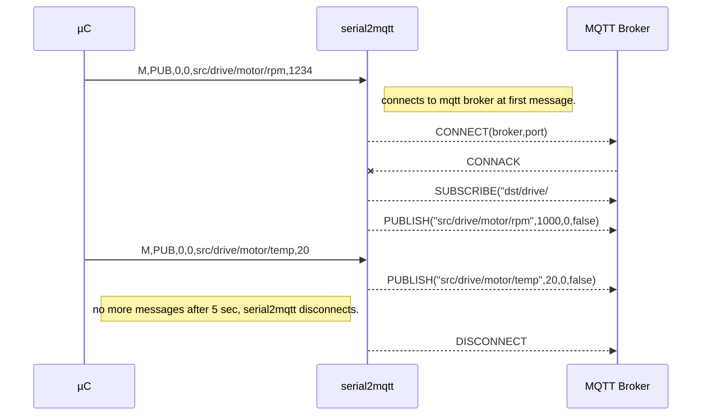
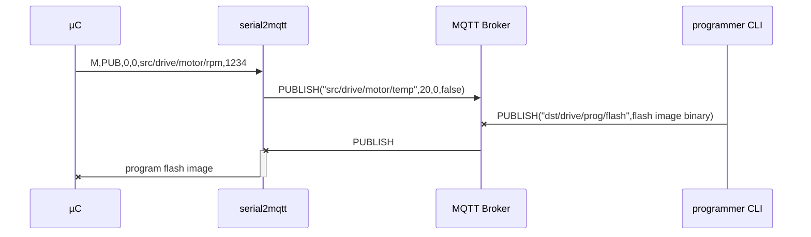

# serial2mqtt
# WORK IN PROGRESS !! Major rework

MQTT for all micro-controllers ! The purpose is to offer MQTT publisher/subscriber functionality to all small micro controllers. Those with just a UART or USB interface.
Example : a cheap STM32 board on ebay.

This program will act as a full MQTT Client gateway and make integration as simple as possible.
This was created because Ethernet or WiFi is still absent in most ( cheap ) controllers .
Also the concept behind is that a central PC or Raspberry PI can act as the intelligent mind behind commodity components.

Arduino Sample program to communicate with the serial2mqtt  gateway

   

    class Mqtt {
      public:
        static void publish(int qos, bool retain, String topic, String message ) {
          Serial.printf("M,%d,%d,%s,%s\n", qos, retain, topic.c_str(), message.c_str());
        }
    };
    int i = 0;
    void loop() {
      delay(100);                       // wait for a 0.1 second
      String  message=String(i++);
      Mqtt::publish(0, false, "src/arduino1/system/upTime", message);
      Mqtt::publish(0,false,"src/arduino1/system/host","arduino1");
    }

## Working assumptions
- Topic Names 
--The design will take into account some assumptions about topic names and tree-structure to make it simple to use.
Structure topic to and from  device :
-- dst/DEVICE/SERVICE/PROPERTY
-- src/DEVICE/SERVICE/PROPERTY
-- if DEVICE is not known yet the serial2mqtt will subscribe to the dst/PORT/prog , where PORT is for example ttyUSB0
- Serial messages will be **BINARY** or **ASCII**
-- BINARY format will be CBOR encoded in a SLIP envelope
-- ASCII will be text delimited by newlines
- The serial2mqtt should be able to reset the device ( hard reset )
- The serial2mqtt should be able to program new code into the device
- Through the same communication, debugging logs can be handled without disturbing the mqtt flow
- the serial2mqtt establishes the client MQTT link and subscribes to dst/DEVICE/#
- when there is a big delay on the serial2mqtt serial input, it will stop the TCP MQTT connection
- serial2mqtt is event driven and not blocking
- one instance of serial2mqtt should be able to handle different serial ports
- USB devices coming and going should be tracked by serial2mqtt
- Configuration can be command line and config file driven ( JSON )
- serial2mqtt should be able to program the device through the serial interface, for this purpose a third party app will be launched with the concerned serial port as argument.

# Protocol
## ASCII TEXT
- `M,PUB,<qos>,<retain>,<topic>,<message>`
## BINARY CBOR SLIP
    <END><SLIP ENCODED MESSAGE><END>
    <SLIP ENCODED MESSAGE> == <'M'><"PUB">,<qos Integer><retain boolean><topic string><message binary><CRC integer>
 ## CONNECTION SETUP

# Programming through serial2mqtt
A command line utility will send a single mqtt request to the serial2mqtt gateway to program the microcontroller.

# Logging through serial2mqtt
The micrcontroller will also log to the central logging system 
