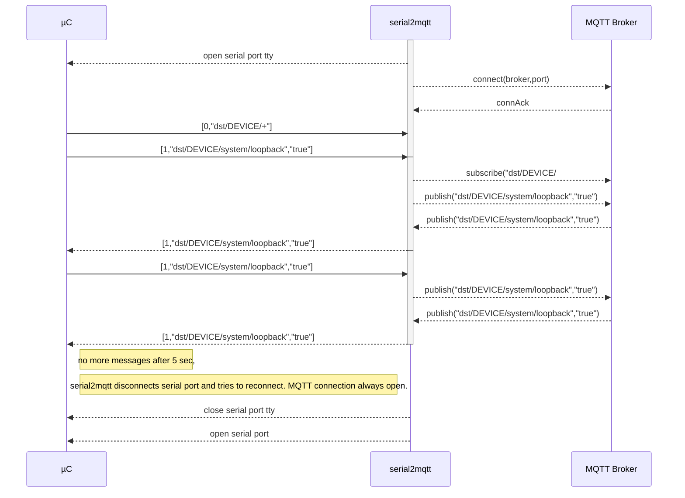
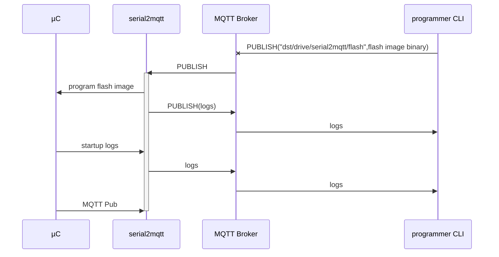

# serial2mqtt
For a complete view : [with UML sequence diagrams](https://vortex314.github.io/Serial2Mqtt.html)
Arduino Sample program to communicate with the serial2mqtt  gateway , see : [Arduino device code](https://github.com/vortex314/mqtt2serial)

MQTT for all micro-controllers ! The purpose is to offer MQTT publisher/subscriber functionality to all small micro controllers. Those with just a UART or USB interface.
Example : some cheap STM32 board on eBay.


This program will act as a full MQTT Client gateway and make integration as simple as possible.
This was created because Ethernet or WiFi is still absent in most ( cheap ) controllers .
Also the concept behind is that a central PC or Raspberry PI can act as the intelligent mind behind commodity components.


   ## Working assumptions and features
- Topic Names 
--The design will take into account some assumptions about topic names and tree-structure to make it simple to use.
Structure topic to and from  device :
-- dst/DEVICE/SERVICE/PROPERTY
-- src/DEVICE/SERVICE/PROPERTY
-- if DEVICE is not known yet the serial2mqtt will subscribe to the dst/HOST.PORT/serial2mqtt/# , where PORT is for example ttyUSB0
- Serial messages will be  **JSON** array or object

-- JSON will be text delimited by newlines
- Through the same communication, debugging logs can be handled without disturbing the mqtt flow. Any line that doesn't start with '{' or be a valid JSON is considered log.
- the serial2mqtt establishes the client MQTT link and subscribes to dst/DEVICE/# when DEVICE is known. 
- when there is a big delay on the serial2mqtt serial input, it will do a serial disconnect and connect attempt , to unlock USB ports
- serial2mqtt is event driven and as much as possible unblocking using MQTT in Async mode
- one instance of serial2mqtt should be able to handle different serial ports
- USB devices coming and going should be tracked by serial2mqtt
- Configuration can be command line and config file driven ( JSON ). command line overrides config settings. 


## Optional 
The serial2mqtt should be able to reset the device ( hard reset )
- The serial2mqtt should be able to program new code into the device
- serial2mqtt should be able to program the device through the serial interface, for this purpose a third party app will be launched with the concerned serial port as argument.

# Protocol
## JSON TEXT
### JSON ARRAY
Example : [1,"mytopic","3.141592653"]
```
[<COMMAND>,<TOPIC>,<MESSAGE>,<QOS>,<RETAIN>,<CRC>] 
* QOS ,RETAIN, CRC  retain are optional
<CRC> : can be checked or not, is calculated on the total JSON string based on the message containing "0000" as temporary CRC. When calculated is in HEX format.
* COMMAND 0:SUBSCRIBE,1:PUBLISH
* publish : [1,"dst/topic1","message1",0,0]
* subscribe : [0,"dst/myTopic/#"]
* QOS : 0,1,2 : for QOS, default 0
* RETAIN : 0 or 1 for true or false, default 0
```
### JSON OBJECT
```
    Example : { "cmd":"MQTT-PUB","topic":"src/device/service/property","message":"1234.66","qos":0,"retained":false }\n
```
TEXT JSON

    { "cmd":"MQTT-PUB","topic":"src/device/service/property","message":"1234.66","qos":0,"retained":false }\n


 ## CONNECTION SETUP

# Programming through serial2mqtt
A command line utility will send a single mqtt request to the serial2mqtt gateway to program the microcontroller.

# Logging through serial2mqtt
Everything that serial2mqtt receives on the serial port is also send on a topic.The micrcontroller will also log to the central logging system 
# Build instructions
 - use Codelite ( optional )
 - clone eclipse/paho.mqtt.c
 - clone bblanchon/ArduinoJnlohmann/json
 - clone vortex314/Common 
 - install libssl-dev ( apt-get  install libssl-dev )
 - build static library in paho.mqtt.c by using makePaho.sh
 - build libCommon.a via "make -f Common.mk"
 - build serial2mqtt via "make -f serial2mqtt.mk" 

**Or just deploy the pre-build versions** from the Debug directory , 2 versions available : Linux 64bits Intel and Raspberry Pi ARM. The armv6l also runs on raspberry pi 3. Watch out for the arch command below. 

    wget https://github.com/vortex314/serial2mqtt/raw/master/Debug/serial2mqtt.`arch`.zip
    wget https://github.com/vortex314/serial2mqtt/raw/master/serial2mqtt.json
    unzip serial2mqtt.`arch`.zip
    mv Debug/serial2mqtt.`arch` serial2mqtt
    
    
    

# Tested
 - ESP32 NodeMCU
# Still to do
 - logging mechanism - DONE 
 - disconnect serial and retry to avoid locking USB ports after timeouts - DONE
 - write binary image to file and send to microcontroller by activating configured external command , example esptool or stm32flash
 - implement binary ? why should I ? 
 - command line tool to flash and monitor logs.  
 -- s2m -f file.bin -m test.mosquitto.org -t pi1-USB0
 -- s2m -f file.bin -m test.mosquitto.org -t steer.USB0
 - Both lines have the same destination, logical and physical destination , if steer device is connected to pi1 host.
 - add other MQTT config params in config file : user, pswd, clientId
 - test with Maple Mini
 -   add static topic through config : "src/DEVICE/serial2mqtt/board" "ESP32-Nodemcu" , which will be published every 5 seconds
 - add "MQTT-SUB" command to give micro-controller control over topic subscription.
 - add log level as parameter -l ( T,D,I,W,E ) for TRACE,DEBUG,INFO,WARN,ERROR level
# Code design
Per serial port there is a main thread and mqtt threads for callback
The main thread waits for events and handle these primarily. 2 timers in this thread are checked for expiry ( not time critical ) : serial-watchdog and mqtt-connect.

To avoid concurrency issues , the callbacks of the mqtt threads are communicated back by writing an event code on a pipe. 
The main threads waits on events : timeout of 1 sec, data on serial file-descriptor or pipe file-descriptor. 
The mqtt event of received message is handled directly by writing the message on the serial port.

<!--stackedit_data:
eyJoaXN0b3J5IjpbLTc2MTYyNTQ5MV19
-->