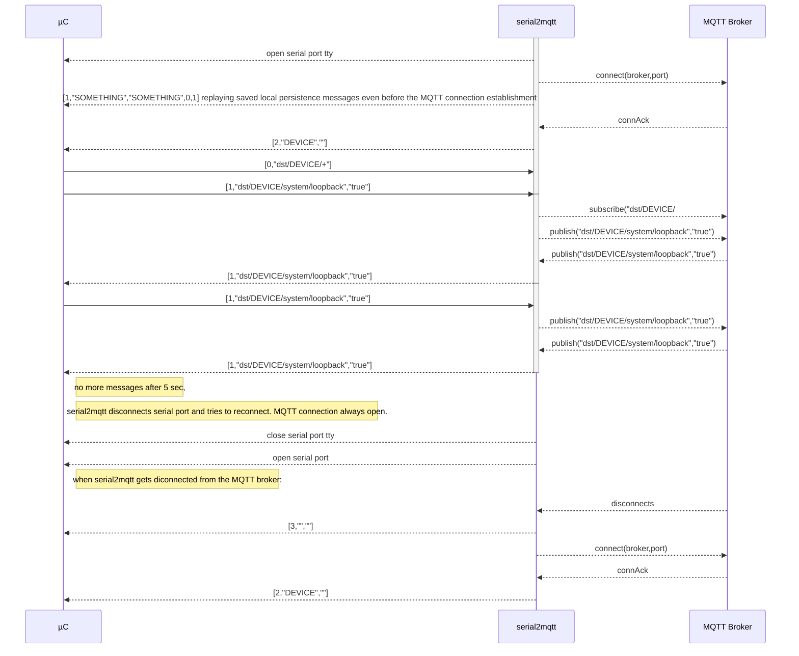

# serial2mqtt
For a complete view : [with UML sequence diagrams](https://vortex314.github.io/serial2mqtt.html)
Arduino Sample program to communicate with the serial2mqtt  gateway , see : [Arduino device code](https://github.com/vortex314/mqtt2serial)

Most simple example : publish uptime to MQTT via serial line. 
```
#include  <Arduino.h>
void  setup() {
Serial.begin(115200);
}
void  loop() {
Serial.println("[1,\"src/myTopic/time\","+String(millis())+"]");
delay(100);
}
```

MQTT for all micro-controllers ! The purpose is to offer MQTT publisher/subscriber functionality to all small micro controllers. Those with just a UART or USB interface.
Example : some cheap STM32 board on eBay. 


I know the ESP32 is capable of Wifi and MQTT on TCP/IP , but in my case it was used for its PWM capabilities and enclosed in a metal box. 

This program will act as a full MQTT Client gateway and make integration as simple as possible.
This was created because Ethernet or WiFi is still absent in most ( cheap ) controllers .
Also the concept behind is that a central PC or Raspberry PI can act as the intelligent mind behind commodity components.


   ## Working assumptions and features
- Topic Names 
--The design will take into account some assumptions about topic names and tree-structure to make it simple to use.
Structure topic to and from  device :
-- dst/DEVICE/SERVICE/PROPERTY
-- src/DEVICE/SERVICE/PROPERTY
-- if DEVICE is not known yet the serial2mqtt will subscribe to the dst/HOST.PORT/serial2mqtt/# , where PORT is for example ttyUSB0
- Serial messages will be  **JSON** array or object

-- JSON will be text delimited by newlines
- Through the same communication, debugging logs can be handled without disturbing the mqtt flow. Any line that doesn't start with '{' or be a valid JSON is considered log.
- the serial2mqtt establishes the client MQTT link and subscribes to dst/DEVICE/# when DEVICE is known. 
- when there is a big delay on the serial2mqtt serial input, it will do a serial disconnect and connect attempt , to unlock USB ports
- serial2mqtt is event driven and as much as possible unblocking using MQTT in Async mode
- one instance of serial2mqtt should be able to handle different serial ports
- USB devices coming and going should be tracked by serial2mqtt
- Configuration can be command line and config file driven ( JSON ). command line overrides config settings. 


## Optional 
The serial2mqtt should be able to reset the device ( hard reset )
- The serial2mqtt should be able to program new code into the device
- serial2mqtt should be able to program the device through the serial interface, for this purpose a third party app will be launched with the concerned serial port as argument.

# Protocol
## JSON TEXT
### JSON ARRAY
Example : [1,"mytopic","3.141592653"]
```
[<COMMAND>,<TOPIC>,<MESSAGE>,<QOS>,<RETAIN>,<CRC>] 
* QOS ,RETAIN, CRC  retain are optional
<CRC> : can be checked or not, is calculated on the total JSON string based on the message containing "0000" as temporary CRC. When calculated is in HEX format.
* COMMAND 0:SUBSCRIBE,1:PUBLISH,2:MQTT-CONN,3:MQTT-DISC
* publish : [1,"dst/topic1","message1",0,0]
* subscribe : [0,"dst/myTopic/#"]
* QOS : 0,1,2 : for QOS, default 0
* RETAIN : 0 or 1 for true or false, default 0
```
- Example publish : [1,"myTopicPi","3.141592653"]
- Example subscribe : [0,"myTopics/#"]
### JSON OBJECT
```
    Example : { "cmd":"MQTT-PUB","topic":"src/device/service/property","message":"1234.66","qos":0,"retained":false }\n
```
TEXT JSON

    { "cmd":"MQTT-PUB","topic":"src/device/service/property","message":"1234.66","qos":0,"retained":false }\n


 ## CONNECTION SETUP

# Programming through serial2mqtt
A command line utility will send a single mqtt request to the serial2mqtt gateway to program the microcontroller.

# Logging through serial2mqtt
Everything that serial2mqtt receives on the serial port is also send on a topic. The micrcontroller will also log to the central logging system 

# Build instructions
Tested with Ubuntu 22.04.4 LTS Desktop 64 bits and Ubuntu 22.04.4 LTS Server 64 bits.

These instructions should fit any Linux distribution, suh as Debian (including Raspberry Pi) and Ubuntu distribution.

`serial2mqtt` is leveraging `paho-mqtt-c` library in secure mode, therefore it requires OpenSSL and crypto library.

Here are the build commands:
```
sudo apt-get  install libssl-dev
git clone --recurse-submodules https://github.com/vortex314/serial2mqtt.git
cd serial2mqtt
cd paho.mqtt.c
cmake -DPAHO_BUILD_STATIC=true -DPAHO_WITH_SSL=true
cmake --build .
make
cd ..
mkdir build
cd build
cmake ..
make
```
    
There's an [experimental OpenWrt package](https://github.com/halfbakery/serial2mqtt-openwrt),
you can build az ipk package from the git head tailored to your system in
less than 5 minutes.


# Configuration
See [Configuring serial2mqtt](doc/CONFIGURATION.md) for details.
    

# Tested
 - ESP32 NodeMCU
# Still to do
 - logging mechanism - DONE 
 - disconnect serial and retry to avoid locking USB ports after timeouts - DONE
 - write binary image to file and send to microcontroller by activating configured external command , example esptool or stm32flash
 - implement binary ? why should I ? 
 - command line tool to flash and monitor logs.  
 -- s2m -f file.bin -m test.mosquitto.org -t pi1-USB0
 -- s2m -f file.bin -m test.mosquitto.org -t steer.USB0
 - Both lines have the same destination, logical and physical destination , if steer device is connected to pi1 host.
 - add other MQTT config params in config file : user, password, clientId - DONE
 - test with Maple Mini
 -   add static topic through config : "src/DEVICE/serial2mqtt/board" "ESP32-Nodemcu" , which will be published every 5 seconds
 - add "MQTT-SUB" command to give micro-controller control over topic subscription.
 - add log level as parameter -l ( T,D,I,W,E ) for TRACE,DEBUG,INFO,WARN,ERROR level
# Code design
Per serial port there is a main thread and mqtt threads for callback
The main thread waits for events and handle these primarily. 2 timers in this thread are checked for expiry ( not time critical ) : serial-watchdog and mqtt-connect.

To avoid concurrency issues , the callbacks of the mqtt threads are communicated back by writing an event code on a pipe. 
The main threads waits on events : timeout of 1 sec, data on serial file-descriptor or pipe file-descriptor. 
The mqtt event of received message is handled directly by writing the message on the serial port.
# Update 30 Dec 2020 : added colorcoding log of protocol and Arduino debug output.
```
    "log" : {
        "protocol":true,
        "debug":true,
        "useColors":true
    }
```
As it it is difficult to debug your implementation of the prorocol on the Arduino, hereby a view what is on the serial line.


## conan package manager
The project uses conan package manager to install dependencies.
To install conan on Ubuntu 20.04 :
```
sudo apt-get install python3-pip
pip3 install conan
conan profile detect
```
To install dependencies :
```
conan install .
```
To build :
```
mkdir build
cd build
cmake ..
make
```
To run :
```
./serial2mqtt
```
<!--stackedit_data:
eyJoaXN0b3J5IjpbNTUzNjc2MDc0XX0=
-->
